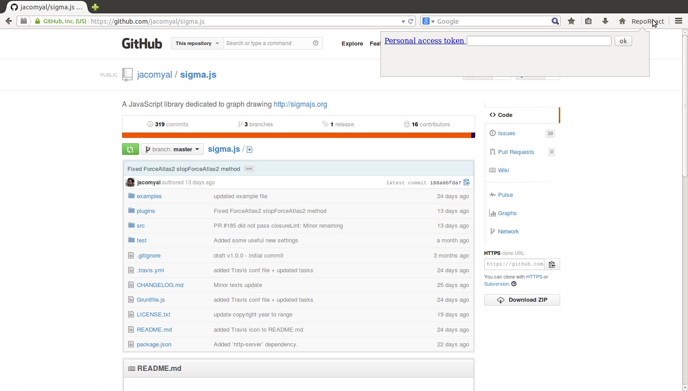
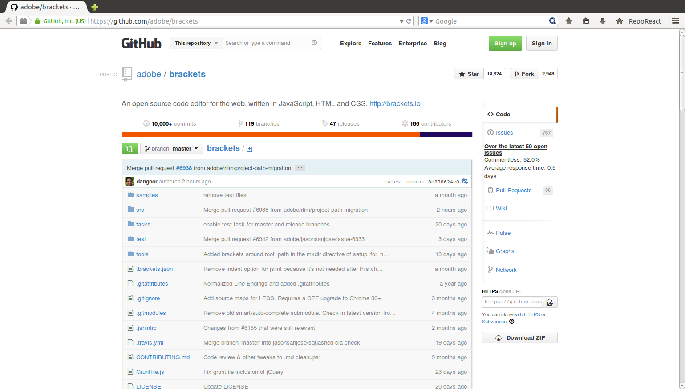

kangax-status-435478540210147328
================================

A solution to https://twitter.com/kangax/status/435478540210147328

> Would be nice if @github showed average response time on issues for each repo; OSS projects w. quick responses always look more promising

This project is a Firefox addon that enhance the Github UI of repository pages to integrate data about repo issues response time.

## About the addon

**The addon only works with Firefox 29+ (current [Aurora](http://www.mozilla.org/en-US/firefox/aurora/)).** I won't do it myself, but I'm happy to help someone port the addon to a Chrome extension (issue #9).

## How the addon works

Feed the addon with a [Github personal access token](https://github.com/blog/1509-personal-api-tokens) with the `public_repo` "scope" enabled.

This part shouldn't be strictly necessary since requests to the Github API can be unauthorized, but it allows a more comfortable rate limit.
When the token is set, go to your favorite Github repo. In a matter of seconds, stats about how many issues remained commentless and how quickly are issues being responded to appear.

(note: because of a [known bug](https://github.com/DavidBruant/kangax-status-435478540210147328/issues/3), the percentage of commentless issues is currently exagerated, don't take the number of this screenshot for granted. Do go [download Brackets](http://download.brackets.io/), though!)

## Contributing 

In the `Firefox` directory, build and test with
`cfx xpi ; cfx -b /home/david/Logiciel/aurora/firefox run kang-4354.xpi`

